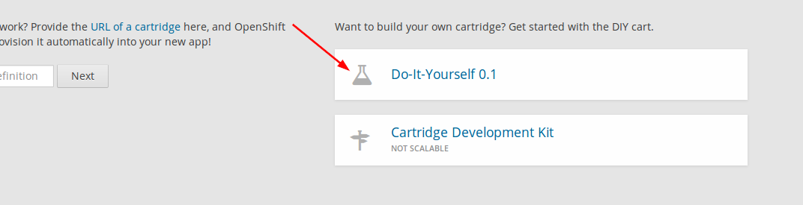

==========================
Hướng dẫn cài đặt Vinacart
==========================

Cấu hình Server
---------------
**Apache**: Yêu cầu bật modules & extension dưới đây:

- *Module*: mod_rewrite
- *Extension*: ioncube_loader, php_intl, php_curl, php_fileinfo, php_gd2, php_mbstring, php_mysql|php_mysqli|php_pdo_mysql

Cài đặt
-------

1. Chuẩn bị Domain.

Nếu cài đặt trên localhost, sử dụng xampp, wamp.. bạn cần tạo alias (vd: ``vinacart.dev``) thay vì sử dụng tên ``localhost``. Ví dụ:
Edit file `c:/xampp/conf/extra/httpd-vhosts.conf`

::

	<VirtualHost *:80>
	    ServerName vinacart.dev
	    ServerAlias www.vinacart.dev
	    DocumentRoot "C:\xampp\htdocs\vinacart"
	    <Directory "C:\xampp\htdocs\vinacart">
	        Order allow,deny
	        Allow from all
	    </Directory>
		ErrorLog C:\xampp\htdocs\error.txt
	</VirtualHost>

2. Tạo database.

3. Thiết lập quyền truy cập Files.

Nếu chạy web trên hệ điều hành Window + xampp/wamp thì bỏ qua bước này. 
Trường hợp sử dụng Linux, để thiết lập chmod đầy đủ cho các file chúng ta chạy file *caidat.php* trên trình duyệt:
``http://vinacart.dev/caidat.php``

4. Tiến hành cài đặt.

Mở trình duyệt, truy cập trang cài đặt: ``http://vinacart.dev/install/``
Làm theo trình tự các bước (wizard). Điền thông tin đầy đủ rồi nhấn cài đặt, chờ trong vài phút để trình cài đặt hoàn tất.
Xem chi tiết _video hướng dẫn cách cài đặt: http://www.vinacart.net/p/download.html

Chú ý: nếu bạn muốn cài đặt lại vinacart, sử dụng URL sau: ``http://vinacart.dev/install/?rt=install&force=1``

**Sử dụng tiền tố www**

Nếu bạn muốn sử dụng tiền tố www, và chuyển hướng URL sang subdomain này sau khi cài đặt xong, truy cập vào trang quản trị sửa lại đường dẫn cửa hàng. Vd: http://www.example.com

*Chú ý*: bạn cần xóa cache và tắt cache nếu URL hoạt động không chính xác. Nếu URL đã hoạt động bạn có thể bật cache trở lại.

Lúc này admin vẫn hoạt động với URL cũ (không có www), tuy nhiên để storefront và admin tự động chuyển hướng sang www khi người dùng gõ tên miền của bạn không chứa www. Bạn thêm dòng sau vào file .htaccess

::

	..
	RewriteRule ^(.*)\?*$ index.php?_route_=$1 [L,QSA]

	# if want to redirect non-www to www
	RewriteCond %{HTTP_HOST} !^www\. [NC]
	RewriteRule ^(.*)$ http://www.%{HTTP_HOST}/$1 [L,QSA]
	..

Nếu tạo nhiều cửa hàng với cùng một domain, (vd: store2.example.com) hãy liệt kê trong danh sách loại bỏ để www được chuyển hướng đúng.

::

	RewriteCond %{HTTP_HOST} !^www\. [NC]
	RewriteCond %{HTTP_HOST} !^store2\. [NC]
	RewriteRule ^(.*)$ http://www.%{HTTP_HOST}/$1 [L,QSA]

Sử dụng Openshift
-----------------
**Bước 1**: Đăng ký một tài khoản miễn phí với openshift online tại https://www.openshift.com/

**Bước 2**: Đăng nhập vào admin và tạo một ứng dụng dạng diy "Do-It-Yourself 0.1" có tên "vinacart" chẳng hạn.

Truy cập URL https://openshift.redhat.com/app/console/applications và chọn vào "Do-It-Yourself 0.1" như hình trên.

**Bước 3**:
Sau khi tạo app hoàn tất, bạn sẽ nhìn thấy địa chỉ git của application này, sử dụng để tải app về local PC.

::

	git clone ssh://5882202680f5cf6963000158@vinacart-<your-domain>.rhcloud.com/~/git/vinacart.git/
	cd vinacart/

Tiếp đến, tải bộ cài đặt vinacart.

::
	
	git clone https://github.com/ktdocker90/vinacart-openshift.git
	cp -R vinacart-openshift/.openshift .
	rm -rf vinacart-openshift

Chú ý: repo helper này chúng ta chỉ cần lấy phần cài đặt trên openshift (thư mục .openshift) do vậy toàn bộ file khác trong thư mục không cần dùng đến nữa.

Bắt đầu xuất bản ứng dụng bằng git.

::

	git add .
	git commit -m 'My changes'
	git push

Chú ý: Build vinacart sẽ mất vài phút, hãy kiên nhân chờ đợi. Quá trình cài đặt server & vinacart ecommerce hoàn tất, địa chỉ app của bạn có dạng:

``vinacart-<your-domain>.rhcloud.com``

Sử dụng Heroku
--------------
Cài đặt vinacart trên heroku hosting.

**Cách 1**:
::
	// tải vinacart project cho heroku
	git clone https://github.com/ktdocker90/heroku-vinacart
	
	heroku heroku buildpacks:set https://github.com/ktdocker90/heroku-buildpack-php-vinacart
