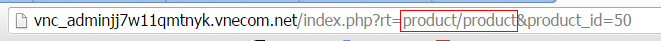

==========================================
Cấu hình theme
==========================================

File cấu hình của theme cho phép bạn thiết lập tùy biến về giao diện hiển thị ở các trang, cũng như khai báo các files assets (.js, .css) cần thiết sử dụng trong các pages.
Ngoài ra bạn có thể tùy chỉnh thêm layout hiển thị riêng cho các page cụ thể và điều chỉnh vị trí của các blocks.

Bạn sửa file này tại ``storefront/view/<theme>/config/theme.xml``
Ví dụ:

::

    <?xml version="1.0" encoding="UTF-8"?>
	<theme>
		<assets>
			<file type="css"><![CDATA[https://fonts.googleapis.com/css?family=Lato:400,700,300]]></file>

			<file type="css"><![CDATA[/assets/css/bootstrap.min.css]]></file>

			<!-- global styles -->
			<file type="js" bottom="1"><![CDATA[/mytheme/themes/js/jquery.scrolltotop.js]]></file>

			<file type="js" bottom="1"><![CDATA[/javascript/bootstrap.min.js]]></file>
			<file type="js" bottom="1"><![CDATA[/assets/js/wow.min.js]]></file>

			<!-- fancybox js
			============================================ -->
			<file type="js" bottom="1"><![CDATA[/assets/js/fancybox/jquery.fancybox.pack.js]]></file>

			<!-- main JS
			============================================ -->
			<file type="js" bottom="1"><![CDATA[/assets/js/main.js]]></file>

			<file type="js" bottom="1"><![CDATA[/javascript/respond.min.js]]></file>
			<file type="js" bottom="1"><![CDATA[/javascript/jquery.validate.js]]></file>
			<file type="js" bottom="1"><![CDATA[/javascript/jquery.carouFredSel-6.1.0-packed.js]]></file>
			<file type="js" bottom="1"><![CDATA[/javascript/jquery.mousewheel.min.js]]></file>
			<file type="js" bottom="1"><![CDATA[/javascript/jquery.touchSwipe.min.js]]></file>
			<file type="js" bottom="1"><![CDATA[/javascript/jquery.ba-throttle-debounce.min.js]]></file>
			<file type="js" bottom="1"><![CDATA[/javascript/jquery.onebyone.min.js]]></file>
			<file type="js" bottom="1"><![CDATA[/javascript/custom.js]]></file>
			<!-- library -->
			<file type="lib"><![CDATA[sliders/bxslider]]></file>
		</assets>
		<assets page="index/home">

		</assets>
		<assets page="about_us">
			<!-- <file type="css" ><![CDATA[]]></file> --><!-- page="index/home" -->
			<!-- <file type="js" bottom="1"><![CDATA[]]></file> --><!-- `buttom` attribute only for js file -->
		</assets>

		<templates>
			<!-- custom templates page -->
		</templates>

		<!-- layout -->
		<layout>
			<!-- custom layouts -->
		</layout>
		<!-- blocks -->
		<blocks>
			<!-- custom blocks -->
		</blocks>
	</theme>

Configuration
=============

::
	
	<?xml version="1.0" encoding="UTF-8"?>
	<theme>
		<!-- configuration -->
	    <configuration>
	        <item name="version" value="1.2"/>
	        <item name="sample_data" value="thoitrang"/>
	        <item name="name" value="mytheme"/>
	        <item name="image_product_width_small" value="100"/>
	        <item name="image_product_height_small" value="95"/>
	    </configuration>

Khai báo các thông tin cấu hình ở thẻ ``<configuration`` như version, sample_data, name.. Trong đó:
- version: phiên bản hiện tại của vinacart
- sample_data: tên dữ liệu mẫu bạn đang viết theme này. Danh sách dữ liệu mẫu gồm có: thoitrang, dulich,...(Bạn có thể bổ xung tùy ý, lưu ý không viết cách & chứa ký tự UTF-8).
- name: tên thư mục theme.

Xem tiếp phần dưới sẽ giải thích chi tiết cách dùng cấu hình.

Assets
======

Khai báo chèn các files .js và .css sử dụng trong theme của bạn vào đây trong cặp thẻ ``<assets``.

::

	<assets>
	    <file type="css"><![CDATA[https://fonts.googleapis.com/css?family=Lato:400,700,300]]></file>
		<file type="css" media="all"><![CDATA[/asset/css/style.css]]></file>
		<file type="js" bottom="1"><![CDATA[/javascript/bootstrap.min.js]]></file>
	</assets>

thuộc tính type chỉ định kiểu file, vd ``type="css"`` dành cho file .css, nếu file bạn muốn load ở cuối trang thì thêm ``bottom="1"`` vào thẻ ``<file`` giống như trên không thì mặc định chúng hiển thị ở trong thẻ ``<head`` (chỉ dành cho file js). 

Đối với file css, bạn có thể bổ xung thuộc tính ``media`` bằng cách khai báo thêm thuộc tính ``media``. vd: *media="all"*

Để cho đơn giản và dễ quản lý tôi đưa toàn bộ các files assets của theme vào một thư mục ``assets`` nằm tại ``storefront/view/<theme_name>/``. Lưu ý: đường dẫn được bắt đầu trong thư mục theme.

Các files css và js hệ thống bạn không được xóa đặc biệt là *.js chúng sử lý hành động của vinacart. vd: ``/javascript``, ``/stylesheet``
Bên cạnh đó chúng ta có thể chèn URL ngoài như thư viện jquery,...google font.

**Đường dẫn (Path)**

Các files chứa trong theme thì được bắt đầu trong thư mục ``storefront/view/<theme_name>/`` và URL bắt đầu bằng dấu ``/`` giống như sau:

::

	<file type="css"><![CDATA[/assets/style.css]]></file>

Những files hệ thống thì cũng giống như vậy nhưng ở tại thư mục theme hệ thống mặc định.

**Load assset ở page chỉ định**

Đôi khi bạn chỉ muốn load các file .css, js ở các page nào đó để tránh load nhiều files không cần thiết với mục đích tăng tốc độ hiển thị website. Chẳng hạn thư viện phóng ảnh chỉ dùng trong trang sản phẩm chi tiết, để thực hiện bạn khai báo thêm thẻ `<assets` như sau.

::

	<assets page="product/product">
		<file type="css" bottom="0"><![CDATA[/assets/custom-slider/css/nivo-slider.css]]></file>        
		<file type="css" bottom="0"><![CDATA[/assets/custom-slider/css/preview.css]]></file>        

		<!-- Nivo slider js
		============================================ -->
		<file type="js" bottom="1"><![CDATA[/assets/custom-slider/js/jquery.nivo.slider.js]]></file>
		<file type="js" bottom="1"><![CDATA[/assets/custom-slider/home.js]]></file>
	</assets>

Thuộc tính ``page`` chứa thông tin địa chỉ page (địa chỉ controller). Ví dụ: ``storefront/controller/blocks/banner_block.php`` thì địa chỉ page sẽ là ``blocks/banner_block`` . Địa chỉ là tham số ``rt`` khi bạn view site, có thể tìm thấy bằng cách view 1 trang sản phẩm.

Chú ý: Mặc định site không bật chế độ SEO Url, để bạn thuận tiện cho việc debug.
Bạn có thể khai báo nhiều thẻ ``assets`` nếu muốn, các thẻ không có thuộc tính ``page`` sẽ load ở mọi trang.

Bạn cũng có thể chỉ định ``page`` bằng tên địa chỉ seo url (alias). VD: Ta có trang about:  http://your-domain/about_us

::

	<assets page="about_us">
		<file type="css" ><![CDATA[/assets/css/file1.css]]></file> --><!-- page="index/home" -->
		<file type="js" bottom="1"><![CDATA[/assets/js/file1.js]]></file> --><!-- `buttom` attribute only for js file -->
	</assets>

Thư viện
^^^^^^^^

Vinacart tích hợp sẵn các thư viện javascript/jquery phổ biến. Với mục đích sử dụng tiện lợi, lý do một số thư viện bao gồm nhiều file css & js, bạn sẽ khó quản lý khi chèn từng file đôi khi một số thư viện sử dụng chung file rất dễ bị nhân bản nếu không sử dụng cẩn thận. Do vậy cách dễ dàng nhất là sử dụng thư viện mặc định của vinacart (Chú ý: bạn cũng có thể khai báo thêm thư viện, nếu muốn).

Ví dụ: gọi thư viện bootstrap.
::

	<file type="lib">
        <param name="name"><![CDATA[ui/bootstrap]]></param>
    </file>

Mặc định sẽ load các files: bootstrap.min.css, bootstrap.min.js

Xem đầy đủ thư viện tại http://tailieu.vinacart.net/

Bạn cũng có viết ngắn gọn như sau:
::
	
	<file type="lib"><![CDATA[ui/bootstrap]]></file>

Tuy nhiên, trường hợp nếu trong thư viện có thêm một số file (vd: file bổ xung cho thư viện đó) không được mặc định load. VD: nivoSlider có nhiều skins khác nhau. Chúng ta khai báo đầy đủ theo cú pháp trên và thêm tên file bạn muốn nạp, mỗi file cách nhau dấu ``|``:
::

	<file type="lib">
        <param name="name"><![CDATA[sliders/nivoSlider]]></param>
        <param name="styles"><![CDATA[light.css]]></param>
    </file>

Ví dụ: nạp các plugin của jquery:
::

	<file type="lib">
        <param name="name"><![CDATA[jquery-libs]]></param>
        <param name="scripts"><![CDATA[jquery.mousewheel.min.js|jquery.touchSwipe.min.js|jquery.ba-throttle-debounce.min.js]]></param>
    </file>

Để bổ xung thêm thư viện, bạn viết vào file ``core/config/library.php``
::

	<?php
	return array(
	    'menu/smartmenus' => array(
	        'scripts'=> array(
	            'jquery.smartmenus.min.js'=> array(
	                'file'=> 'jquery.smartmenus.min.js',
	                'required'=> 1,
	                'bottom'=> 1
	            ),
	            'jquery.smartmenus.bootstrap.js'=> array(
	                'file' => 'addons/bootstrap/jquery.smartmenus.bootstrap.min.js',
	                'required'=> 1,
	                'bottom'=> 1
	            )
	        ),
	        'styles'=> array(
	            'sm-core-css.css'=> array(
	                'file'=> 'css/sm-core-css.css',
	                'required'=> 1
	            ),
	            'jquery.smartmenus.bootstrap.css' => array(
	                'file'=> 'addons/bootstrap/jquery.smartmenus.bootstrap.css',
	                'required'=> 1
	            ),
	            'sm-blue.css'=> array(
	                'file'=> 'css/sm-blue/sm-blue.css',
	                'required'=> 0
	            ),
	            'sm-clean.css' => array(
	                'file'=> 'css/sm-clean/sm-clean.css',
	                'required'=> 1
	            ),
	            'sm-mint' => array(
	                'file'=> 'css/sm-mint/sm-mint.css',
	                'required'=> 0
	            ),
	            'sm-simple' => array(
	                'file'=> 'css/sm-simple/sm-simple.css',
	                'required'=> 0
	            )
	        )
	    )
	);

Templates
=========

Mặc định mọi trang sẽ gọi vào ``common/page.tpl`` như vậy bạn sẽ viết template chung cho toàn bộ pages vào file này, tuy nhiên nếu bạn muốn linh hoạt hơn bằng cách viết template cho các page khác nhau vào các file khác nhau, chúng ta sẽ khai báo thêm templates vào thẻ ``<templates``.

::

	<templates>
		<!-- alway use short path -->
		<page context="index/home" template="common/page-home.tpl"></page>
		<!-- <page context="index/maintenance" template="common/page-maintenance.tpl"></page> -->
		<page context="content/contact" template="common/page-contact.tpl"></page>
		<page context="content/content" args="content_id=1" template="common/page-aboutus.tpl"></page>
		<page context="product/product"  template="common/page-product.tpl"></page>
		<page context="product/category"  template="common/page-category.tpl"></page>
		<page context="product/manufacturer"  template="common/page-category.tpl"></page>
		<page context="product/search"  template="common/page-category.tpl"></page>
		<page context="product/special"  template="common/page-category.tpl"></page>

	</templates>

Mỗi page có template riêng biệt được khai báo vào thẻ ``<page``, địa chỉ page bởi thuộc tính ``context`` và địa chỉ .tpl xuất phát trong thư mục ``template`` của theme, khai báo vào thuộc tính ``template``.

**Lọc page bởi tham số**

Bạn cũng có thể sử dụng nhiều templates cho 1 trang, bằng cách lọc tham số URL. Ở ví dụ trên, page ``content/content`` sẽ hiển thị nội dung trang có *id=1*, khai báo tham số ``content_id`` vào thuộc tính ``args``.

::

	<page context="content/content" args="content_id=1" template="common/page-aboutus.tpl"></page>

Nếu nhiều hơn một tham số, các tham số cách nhau bởi dấu ``&`` vd: `arg1=value1&arg2=value2`
Viết thêm mỗi template (.tpl) mới, bạn cần khai báo vào ``<custom_templates``.

::

	<custom_templates>
		<tpl><![CDATA[common/page-home.tpl]]></tpl>
		<tpl><![CDATA[common/page-contact.tpl]]></tpl>
		<tpl><![CDATA[common/page-product.tpl]]></tpl>
		<tpl><![CDATA[common/page-category.tpl]]></tpl>
	    ...
	</custom_templates>

Layout
======

Vinacart có một số templates layout mặc định sau:

- Default Page Layout
- Home Page
- Checkout Pages
- Login Page
- Default Product Page
- Maintenance Page
- Customer Account Pages
- Cart Page
- Product Listing Page.

Ngoài ra, vinacart cho phép bạn thêm layout cho nội dung category, product bạn muốn tùy chỉnh layout. 
Tuy nhiên việc tùy biến mọi layout sẽ không được phép trong giao diện admin.

Ví dụ trang liên hệ bạn muốn chèn thêm block bản đồ sẽ không được, bạn không thể thao tác trong admin và cần khai báo thêm layout cho page bạn muốn thay đổi dữ liệu (blocks).
Viết vào file cấu hình theme (theme.xml) nội dung sau:

::

	<layout>
		<page name="Category Layout" context="product/category" default="1">
			<apply context="product/manufacturer" />
		</page>
		<page name="Contact Page" context="content/contact" default="1">
			
		</page>
	</layout>

Tham số:

- ``name`` - Tên hiển thị layout.
- ``context`` - địa chỉ page.
.. ``param`` - tên tùy ý không dấu cách và không được trùng với các layout khác.

Các tham số khác để mặc định.
Nếu bạn muốn áp dụng một layout cho các page khác, khai báo thẻ con ``<apply`` giống như trên.

Blocks
======

Có 2 loại block:

- parent block: gồm ``header``, ``header_bottom``, ``column_left``, ``column_right``, ``content_top``, ``content_bottom``
- child block: là các blocks con chứa trong parent block. vd: latest, bestsellers, account,..

Vinacart quy định các child blocks giới hạn hiển thị trong parent blocks. VD, block *bestsellers* mặc định chỉ hiển thị ở ``column_left``, ``column_right``, ``content_bottom``.

Tuy nhiên bạn có thể mở rộng hiển thị các blocks ở vị trí parent blocks khác để thuận lợi trong việc phát triển theme. Để làm điều này bạn khai báo vào thẻ ``<blocks``. Xem ví dụ dưới đây:

::

	<blocks>
		<block>
			<!-- example of overriding block -->
			<block_txt_id><![CDATA[bestsellers]]></block_txt_id>
			<controller>blocks/bestseller</controller>
			<templates>
				<__AUTO_INCREASE__>
					<parent_block_txt_id><![CDATA[footer_top]]></parent_block_txt_id>
					<template><![CDATA[blocks/bestseller.tpl]]></template>
				</__AUTO_INCREASE__>
				<__AUTO_INCREASE__>
					<parent_block_txt_id><![CDATA[header_bottom]]></parent_block_txt_id>
					<template><![CDATA[blocks/bestseller_home.tpl]]></template>                    
				</__AUTO_INCREASE__>
				<__AUTO_INCREASE__>
					<parent_block_txt_id><![CDATA[column_left]]></parent_block_txt_id>
					<template><![CDATA[blocks/bestseller.tpl]]></template>
				</__AUTO_INCREASE__>
				<__AUTO_INCREASE__>
					<parent_block_txt_id><![CDATA[content_bottom]]></parent_block_txt_id>
					<template><![CDATA[blocks/bestseller_home.tpl]]></template>
				</__AUTO_INCREASE__>
				<__AUTO_INCREASE__>
					<parent_block_txt_id><![CDATA[column_right]]></parent_block_txt_id>
					<template><![CDATA[blocks/bestseller.tpl]]></template>
				</__AUTO_INCREASE__>

			</templates>
			<custom_templates>
				<__AUTO_INCREASE__>
					<parent_block_txt_id><![CDATA[footer_top]]></parent_block_txt_id>
					<template><![CDATA[blocks/bestseller.tpl]]></template>
					<page valueAsAttrs="1" context="content/content" args="content_id=1"></page>
				</__AUTO_INCREASE__>
				<__AUTO_INCREASE__>
					<parent_block_txt_id><![CDATA[header_bottom]]></parent_block_txt_id>
					<template><![CDATA[blocks/bestseller_home.tpl]]></template>                    
				</__AUTO_INCREASE__>
			</custom_templates>
		</block>
	</blocks>

*Giải thích*:

- ``block_txt_id`` - txt id của block.
- ``controller`` -  controller hiển thị nội dung block.
- ``templates`` - Khai báo parent block và template mặc định của block hiển thị ở vị trí đó, trong mỗi cặp thẻ ``<__AUTO_INCREASE__``.
- ``custom_templates`` - khai báo các template đã thêm ngoài template mặc định của block vào đây.

Để block này có hiệu lực, bạn sẽ nạp lại cấu hình bằng cách truy cập **Design > My Settings > Install & Configure** nhấn vào tab **Refresh Extensions** và click **Refresh Blocks**

Ok, quay trở lại trang layout trong admin, chọn layout trong danh sách bạn sẽ thấy bổ xung các layout mới.

.. image:: images/vnc-layouts.jpg

Cấu hình block
^^^^^^^^^^^^^^

Tất cả các blocks sẽ sử dụng chung cấu hình của vinacart mà bạn đã thiết lập (tại Admin URL: /index.php?rt=setting/setting/all).
Đôi khi một vài block sẽ cần thay đổi lại giá trị, chẳng hạn như block bestseller, latest nằm ở cột trái (column_left) kích thước ảnh theo thiết kế theme là nhỏ hơn so với hiển thị products ở trang chủ, trang danh mục sản phẩm. 

Kích thước ảnh này quy định bởi cấu hình *config_image_product_width*, *config_image_product_height*. Bạn có thể dễ dàng thay đổi thông số này áp dụng cho parent block & child block, giống như sau:
::

	<blocks>
		<block>
			<block_txt_id><![CDATA[column_left]]></block_txt_id>
			<controller>common/column_left</controller>
			
			<config>
				<param name="config_image_product_width"><![CDATA[100]]></param>
				<param name="config_image_product_height"><![CDATA[95]]></param>
			</config>
		</block>
	</blocks>

Lưu ý: với mỗi kích thước tạo ra sẽ tạo thêm ảnh mới tương ứng với kích thước đó, cho nên hãy cẩn trọng để tránh gây thừa dung lượng. Nếu bạn sử dụng nhiều lần giá trị cấu hình cách tốt nhất thiết vào biến để tránh viết nhầm giá trị.
::

	<configuration>
        <item name="image_product_width_small" value="100"/>
        <item name="image_product_height_small" value="95"/>
    </configuration>
	<block>
		..
		<config>
	        <param name="config_image_product_width"><![CDATA[image_product_width_small]]></param>
	        <param name="config_image_product_height"><![CDATA[image_product_height_small]]></param>
	    </config>
	</block>

Block Skin
^^^^^^^^^^

Kế thừa hầu hết các cms hiện nay như wordpress, bạn có thể khai báo giao diện sidebar dễ dàng với vinacart. Thiết lập trong file cấu hình (``theme.xml``)

Khai báo các skin sử dụng cho theme:
::

	<block_skins>
        <skin name="skin1">
            <param name="before_title"><![CDATA[
<h2>]]></param>
            <param name="after_title"><![CDATA[</h2>
]]></param>
            <param name="before_widget"><![CDATA[
]]></param>
            <param name="after_widget"><![CDATA[
]]></param>
        </skin>
        <skin name="sidebar">
            <param name="before_title"><![CDATA[<h3 class="%2$s">]]></param>
            <param name="after_title"><![CDATA[</h3>]]></param>
            <param name="before_widget"><![CDATA[
]]></param>
            <param name="after_widget"><![CDATA[
]]></param>
        </skin>

        <skin name="footer">
            <param name="before_title"><![CDATA[<h3 class="%2$s">]]></param>
            <param name="after_title"><![CDATA[</h3>]]></param>
            <param name="before_widget"><![CDATA[
]]></param>
            <param name="after_widget"><![CDATA[
]]></param>
        </skin>
        <skin name="blog_sidebar">
            <param name="before_title"><![CDATA[<h3 class="%2$s">]]></param>
            <param name="after_title"><![CDATA[</h3>]]></param>
            <param name="before_widget"><![CDATA[
]]></param>
            <param name="after_widget"><![CDATA[
]]></param>
        </skin>
    </block_skins>

Áp dụng skin vào parent block.

::

	<blocks>
		<block>
			<block_txt_id><![CDATA[header]]></block_txt_id>
			<controller>common/header</controller>
			<skin>
				<name><![CDATA[skin1]]></name>
				<values>
					<param name="before_title"><![CDATA[block1]]></param>
					<param name="before_widget"><![CDATA[block_1]]></param>
				</values>
			</skin>
		</block>
		<block>
			<block_txt_id><![CDATA[header_bottom]]></block_txt_id>
			<controller>common/header_bottom</controller>
			<skin>
				<name><![CDATA[skin1]]></name>
				<values>
					<param name="before_title"><![CDATA[block1]]></param>
					<param name="before_widget"><![CDATA[block_1]]></param>
				</values>
			</skin>
		</block>
		<block>
			<block_txt_id><![CDATA[column_left]]></block_txt_id>
			<controller>common/column_left</controller>
			<skin>
				<name><![CDATA[sidebar]]></name>
				<values>
					<param name="before_title"><![CDATA[block1]]></param>
					<param name="before_widget"><![CDATA[block_1]]></param>
				</values>
			</skin>
			<config>
				<param name="config_image_product_width"><![CDATA[100]]></param>
				<param name="config_image_product_height"><![CDATA[95]]></param>
			</config>
		</block>
		<block>
			<block_txt_id><![CDATA[column_right]]></block_txt_id>
			<controller>common/column_right</controller>
			<skin>
				<name><![CDATA[blog_sidebar]]></name>
				<values>
					<param name="before_title"><![CDATA[block1]]></param>
					<param name="before_widget"><![CDATA[block_1]]></param>
				</values>
			</skin>
		</block>
		..
	</blocks>

Chú ý: giá trị biến ``before_title``, ``after_title`` ở thẻ ``<param`` tương ứng với biến ``%2$s``.

Trong file .tpl để hiển thị skin chúng ta có các biến:
::

	{{before_widget}}
		..
		{{ before_title}}{{ heading_title }} {{ after_title}}
		..
	{{after_widget}}

